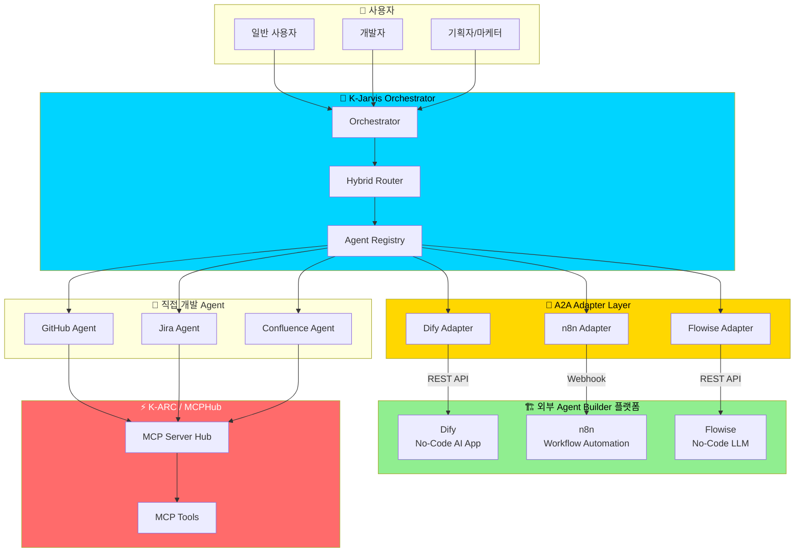
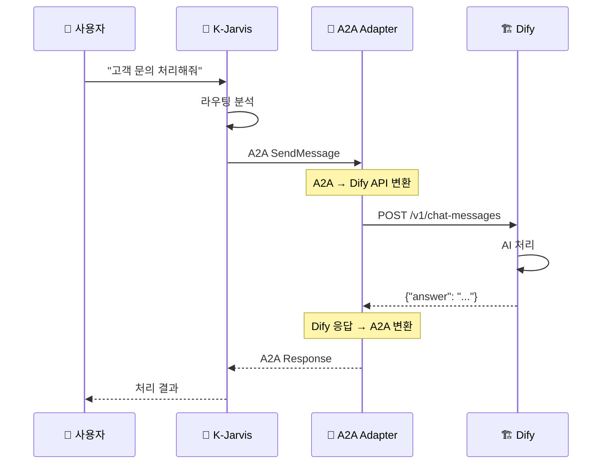
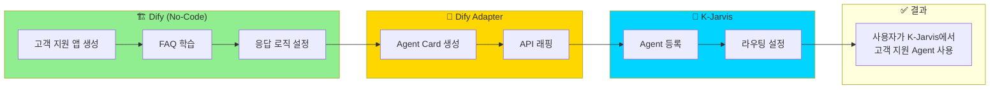
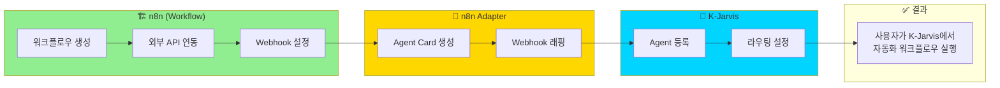
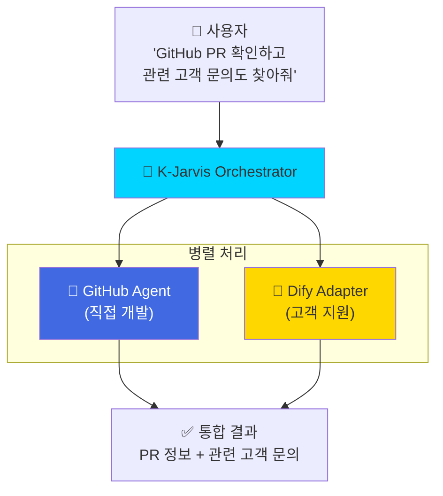

# 2026년도 먹거리 발굴 - Agent Builder 플랫폼 연동 전략

> 아래 내용을 컨플루언스 페이지 (https://ktspace.atlassian.net/wiki/spaces/CNCORE/pages/548700691) 에 추가해주세요.

---

## 📌 추가할 섹션: 외부 Agent Builder 플랫폼 연동

### 배경

현재 시장에는 **No-Code/Low-Code AI Agent Builder** 플랫폼들이 급성장하고 있습니다:

| 플랫폼 | 특징 | 사용자 |
|--------|------|--------|
| **Dify** | No-Code AI App Builder | 비개발자, 기획자 |
| **n8n** | Workflow Automation | 마케터, 운영팀 |
| **CrewAI** | Multi-Agent Framework | 개발자 |
| **Flowise** | No-Code LLM Builder | 비개발자 |
| **LangGraph** | Agent Framework | 개발자 |

이 플랫폼들로 만든 Agent를 **K-Jarvis 생태계에 연동**하면:
- 비개발자도 Agent 생성 가능
- 생태계 빠른 확장
- 다양한 사용 사례 수용

---

### K-Jarvis의 강점: A2A 프로토콜 표준 준수

K-Jarvis는 **Google A2A (Agent-to-Agent) 프로토콜**을 준수합니다.

이는 다음을 의미합니다:
1. **A2A 지원 플랫폼** → 직접 연동 가능 (설정만으로)
2. **A2A 미지원 플랫폼** → A2A Adapter 개발하여 연동

---

### 연동 아키텍처

#### Mermaid 다이어그램 (복사하여 컨플루언스에 붙여넣기)

---

### A2A Adapter 동작 방식

---

### 연동 시나리오

#### 시나리오 1: Dify로 만든 고객 지원 Agent

#### 시나리오 2: n8n 워크플로우 Agent

#### 시나리오 3: 멀티 플랫폼 체이닝

---

### 기대 효과

| 항목 | 현재 | 연동 후 |
|------|------|---------|
| **Agent 개발 주체** | 개발자만 | 비개발자도 가능 |
| **Agent 생성 시간** | 수일~수주 | 수시간 |
| **생태계 확장 속도** | 느림 | 빠름 |
| **사용 사례** | 제한적 | 다양 |

---

### 구현 계획

| Phase | 내용 | 기간 |
|-------|------|------|
| **Phase 1** | Dify Adapter PoC | 2주 |
| **Phase 2** | n8n, Flowise Adapter | 2주 |
| **Phase 3** | 통합 테스트 및 문서화 | 1주 |
| **Phase 4** | 사내 개발자 대상 베타 | 2주 |

---

### 핵심 메시지

> **K-Jarvis는 A2A 프로토콜 표준을 준수하여, 다양한 Agent Builder 플랫폼과 쉽게 연동할 수 있습니다.**
> 
> 이를 통해:
> - 🎯 **비개발자도 Agent 생성 가능** (Dify, n8n, Flowise 활용)
> - 🚀 **생태계 빠른 확장** (A2A Adapter로 연동)
> - 🔗 **멀티 플랫폼 체이닝** (직접 개발 Agent + 외부 Agent 조합)

---

## 📝 컨플루언스 붙여넣기 가이드

### Mermaid 다이어그램 삽입 방법

1. 컨플루언스 페이지 편집 모드 진입
2. `/mermaid` 또는 `Mermaid Diagram` 매크로 삽입
3. 위의 Mermaid 코드 복사하여 붙여넣기
4. 저장

### 표 삽입

- 위의 마크다운 표를 컨플루언스 표로 변환하여 삽입
- 또는 `/table` 매크로 사용

---

**이 내용을 2026년도 먹거리 발굴 페이지에 추가하면 됩니다!**

