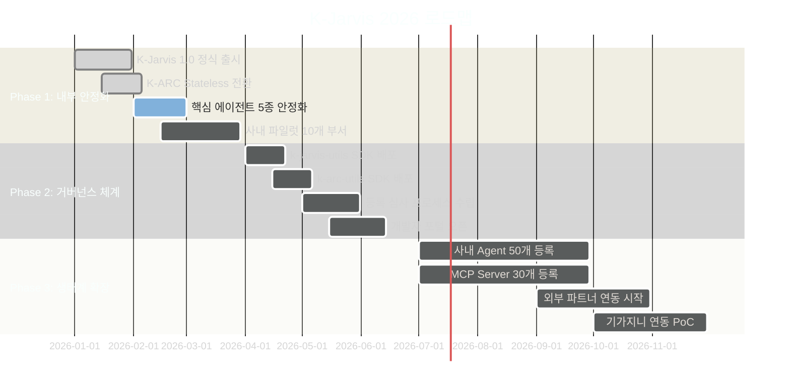
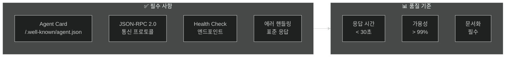
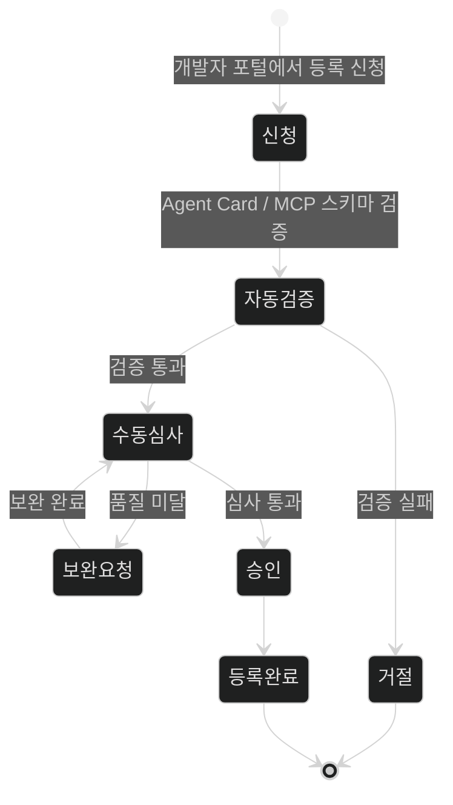
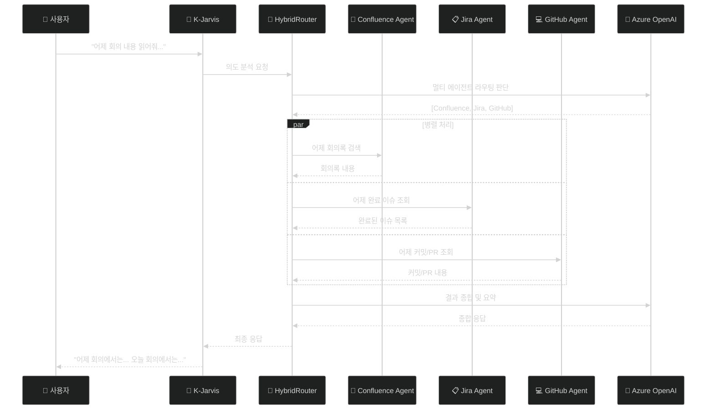
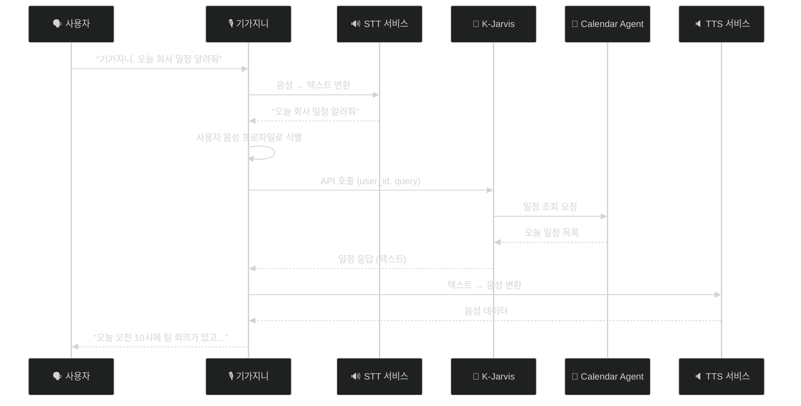
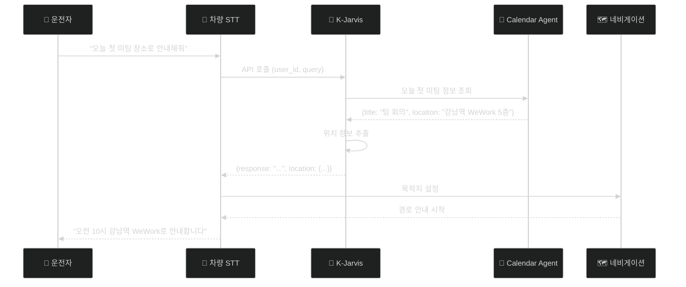
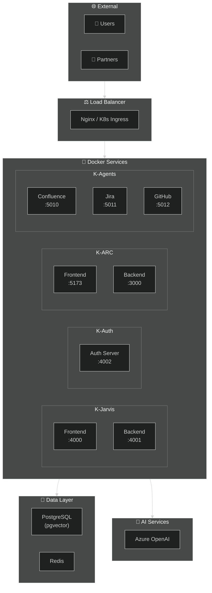
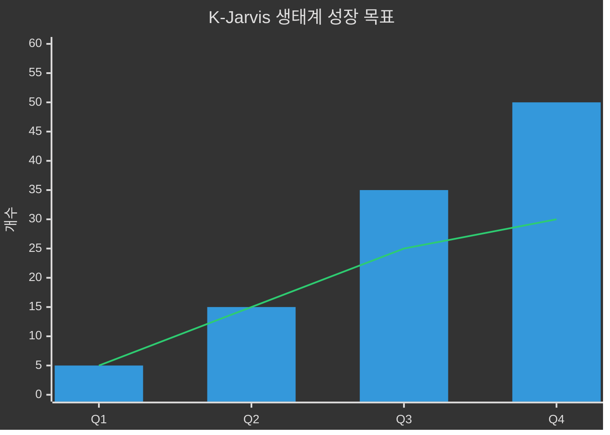
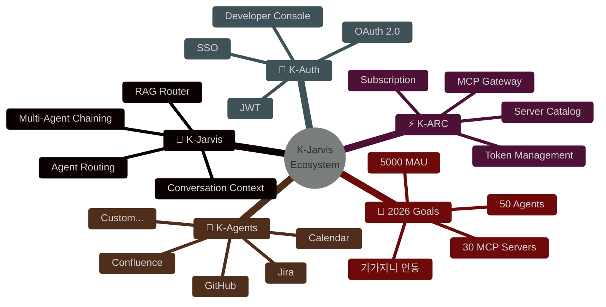

# K-Jarvis 2026 비전 문서 - Mermaid 다이어그램 코드

> **용도**: Confluence 업로드 시 수동 삽입용  
> **작성일**: 2025-12-29

---

## 1. 전체 아키텍처 다이어그램

```mermaid
%%{init: {'theme': 'dark', 'themeVariables': { 'primaryColor': '#00d4ff', 'primaryTextColor': '#fff', 'primaryBorderColor': '#00d4ff', 'lineColor': '#00d4ff', 'secondaryColor': '#1a1a2e', 'tertiaryColor': '#16213e'}}}%%
flowchart TB
    subgraph Users["👥 사용자 접점"]
        Web["🌐 Web Browser"]
        Mobile["📱 Mobile App"]
        GiGaGenie["🎙️ 기가지니"]
        SmartCar["🚗 스마트카"]
        API["🔌 External API"]
    end

    subgraph KJarvis["🤖 K-Jarvis Platform"]
        Orchestrator["🎯 Orchestrator<br/>(Agent Routing)"]
        HybridRouter["🧠 HybridRouter<br/>(RAG + LLM)"]
        ConversationMgr["💬 Conversation<br/>Manager"]
    end

    subgraph KAuth["🔐 K-Auth"]
        OAuth["OAuth 2.0<br/>Server"]
        JWT["JWT Token<br/>Service"]
        UserMgmt["User<br/>Management"]
    end

    subgraph KARC["⚡ K-ARC (MCPHub)"]
        MCPGateway["MCP Gateway"]
        TokenMgr["Token<br/>Manager"]
        ServerCatalog["Server<br/>Catalog"]
    end

    subgraph Agents["🤖 K-Agents"]
        ConfAgent["📄 Confluence<br/>Agent"]
        JiraAgent["📋 Jira<br/>Agent"]
        GitAgent["💻 GitHub<br/>Agent"]
        CalAgent["📅 Calendar<br/>Agent"]
        CustomAgent["🔧 Custom<br/>Agents..."]
    end

    subgraph MCPServers["🔧 MCP Servers"]
        ConfMCP["Confluence<br/>MCP"]
        JiraMCP["Jira<br/>MCP"]
        GitMCP["GitHub<br/>MCP"]
        SlackMCP["Slack<br/>MCP"]
        CustomMCP["Custom<br/>MCPs..."]
    end

    subgraph Infra["🏗️ Infrastructure"]
        PostgreSQL["🐘 PostgreSQL<br/>(pgvector)"]
        Redis["⚡ Redis"]
        AzureOpenAI["🧠 Azure<br/>OpenAI"]
    end

    Users --> KAuth
    KAuth --> KJarvis
    KJarvis --> Agents
    Agents --> KARC
    KARC --> MCPServers
    KJarvis --> Infra
    KARC --> Infra
    KAuth --> Infra
```

---

## 2. 연간 로드맵 Gantt 차트

---

## 3. Agent 개발 거버넌스 플로우

---

## 4. 등록 심사 프로세스 상태 다이어그램

---

## 5. 개발자의 하루 시나리오 시퀀스 다이어그램

---

## 6. 기가지니 연동 시퀀스 다이어그램

---

## 7. 스마트카 연동 시퀀스 다이어그램

---

## 8. 인프라 구성 다이어그램

---

## 9. 생태계 성장 목표 차트

---

## 10. 비전 요약 다이어그램

---

## Confluence 업로드 방법

1. Confluence 페이지 편집 모드 진입
2. `/` 입력 후 "Mermaid" 검색
3. Mermaid 매크로 삽입
4. 위 코드 복사하여 붙여넣기
5. 저장

**참고**: Confluence에서 Mermaid가 지원되지 않는 경우:
- Mermaid Live Editor (https://mermaid.live) 에서 PNG/SVG로 내보내기
- 이미지로 삽입

---

**K-Jarvis Orchestrator Team** 🚀

