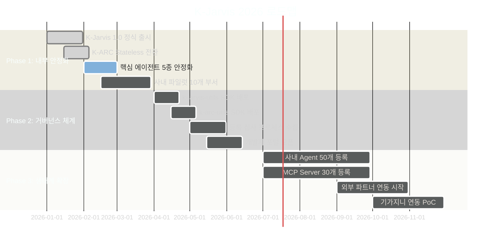
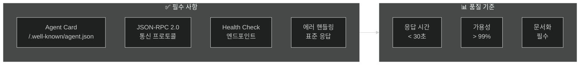
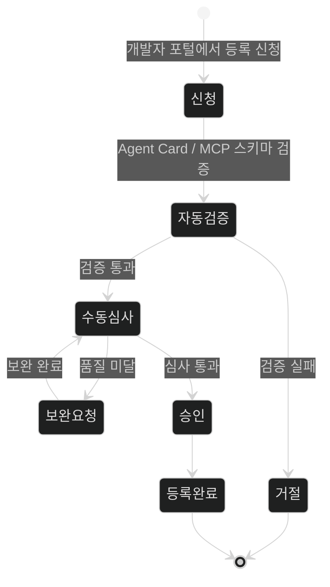
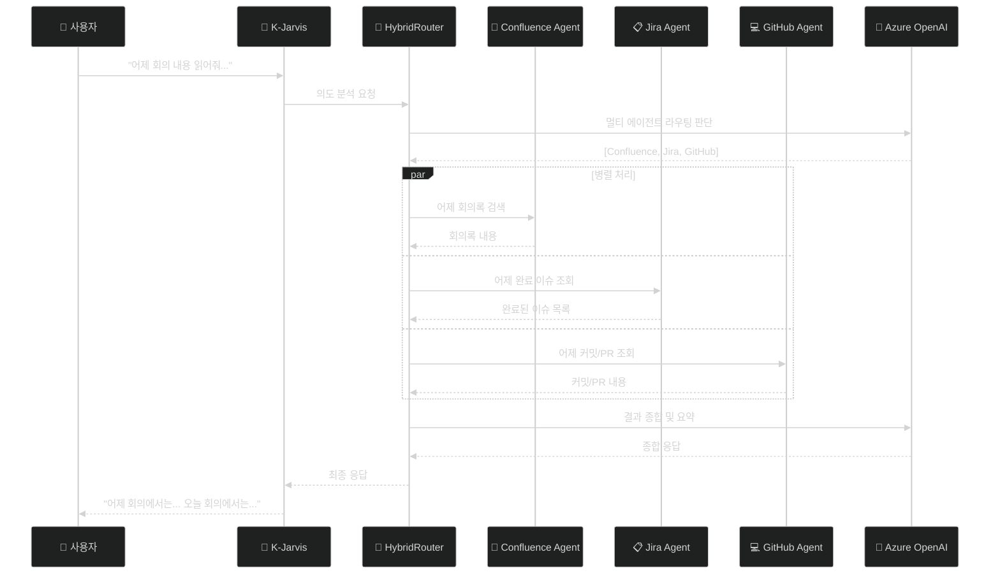
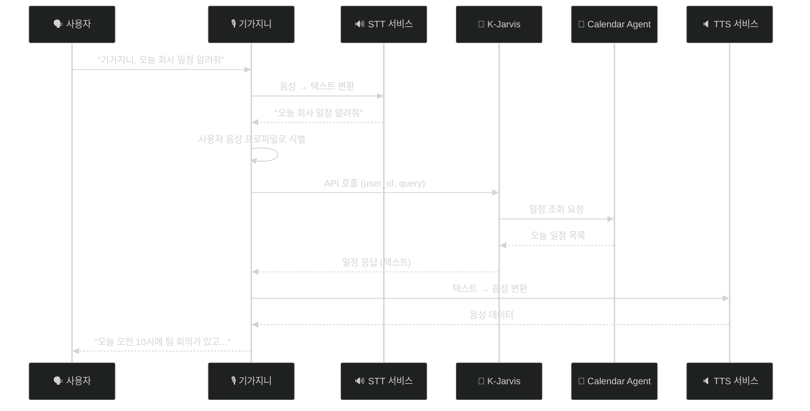
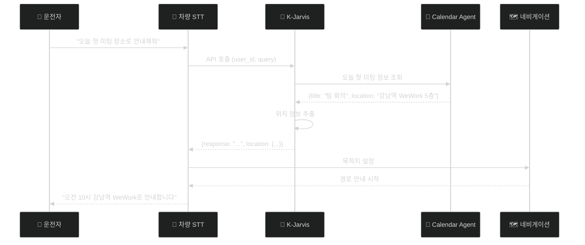
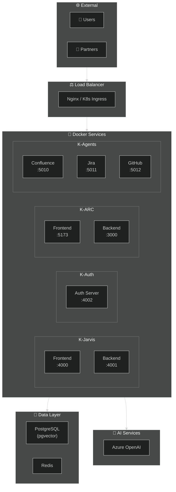
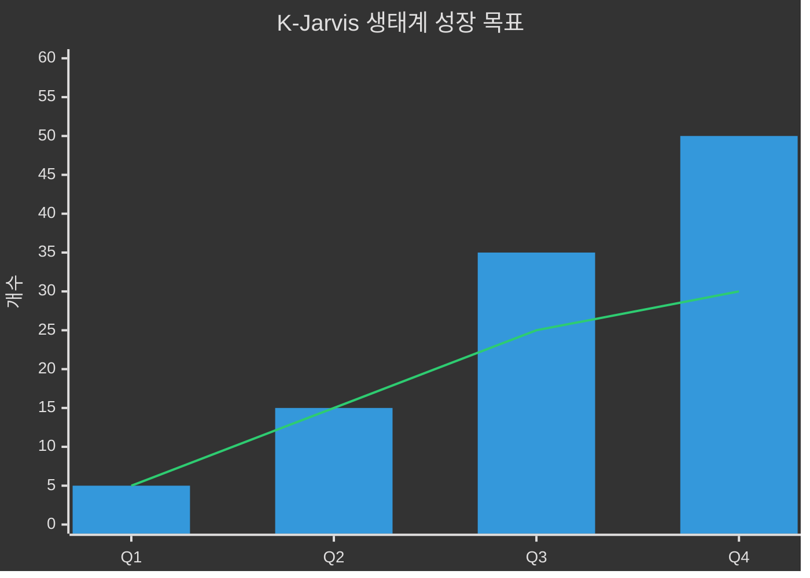

# K-Jarvis 생태계 2026 비전 및 전략

> **작성일**: 2025-12-29  
> **작성팀**: K-Jarvis Orchestrator Team  
> **버전**: 1.0  
> **상태**: 🚀 전략 문서  
> **Confluence 업로드용**: CNCORE Space

---

## 1. Executive Summary

K-Jarvis는 KT의 차세대 **AI 에이전트 오케스트레이션 플랫폼**입니다.  
아이언맨의 만능 AI 비서 **J.A.R.V.I.S**에서 영감을 받아, **"무엇이든 수행할 수 있는 AI 비서"**를 목표로 합니다.

### 🎯 핵심 비전

```
"KT의 모든 서비스를 연결하고, 누구나 AI 에이전트를 개발하여 
 K-Jarvis 생태계에 기여할 수 있는 오픈 플랫폼"
```

### 핵심 목표

| 목표 | 설명 |
|------|------|
| **🤖 Agent Ecosystem** | A2A 표준 기반의 확장 가능한 에이전트 생태계 구축 |
| **🔧 Tool Ecosystem** | MCP 표준 기반의 도구 통합 플랫폼 (K-ARC) 운영 |
| **📋 Governance** | 명확한 개발 거버넌스로 품질 높은 생태계 확장 |
| **🏢 Enterprise Scale** | KT 전사 및 외부 파트너까지 확장 가능한 플랫폼 |

---

## 2. 플랫폼 구성요소

### 2.1 전체 아키텍처 (Mermaid)

```mermaid
%%{init: {'theme': 'dark', 'themeVariables': { 'primaryColor': '#00d4ff', 'primaryTextColor': '#fff', 'primaryBorderColor': '#00d4ff', 'lineColor': '#00d4ff', 'secondaryColor': '#1a1a2e', 'tertiaryColor': '#16213e'}}}%%
flowchart TB
    subgraph Users["👥 사용자 접점"]
        Web["🌐 Web Browser"]
        Mobile["📱 Mobile App"]
        GiGaGenie["🎙️ 기가지니"]
        SmartCar["🚗 스마트카"]
        API["🔌 External API"]
    end

    subgraph KJarvis["🤖 K-Jarvis Platform"]
        Orchestrator["🎯 Orchestrator<br/>(Agent Routing)"]
        HybridRouter["🧠 HybridRouter<br/>(RAG + LLM)"]
        ConversationMgr["💬 Conversation<br/>Manager"]
    end

    subgraph KAuth["🔐 K-Auth"]
        OAuth["OAuth 2.0<br/>Server"]
        JWT["JWT Token<br/>Service"]
        UserMgmt["User<br/>Management"]
    end

    subgraph KARC["⚡ K-ARC (MCPHub)"]
        MCPGateway["MCP Gateway"]
        TokenMgr["Token<br/>Manager"]
        ServerCatalog["Server<br/>Catalog"]
    end

    subgraph Agents["🤖 K-Agents"]
        ConfAgent["📄 Confluence<br/>Agent"]
        JiraAgent["📋 Jira<br/>Agent"]
        GitAgent["💻 GitHub<br/>Agent"]
        CalAgent["📅 Calendar<br/>Agent"]
        CustomAgent["🔧 Custom<br/>Agents..."]
    end

    subgraph MCPServers["🔧 MCP Servers"]
        ConfMCP["Confluence<br/>MCP"]
        JiraMCP["Jira<br/>MCP"]
        GitMCP["GitHub<br/>MCP"]
        SlackMCP["Slack<br/>MCP"]
        CustomMCP["Custom<br/>MCPs..."]
    end

    subgraph Infra["🏗️ Infrastructure"]
        PostgreSQL["🐘 PostgreSQL<br/>(pgvector)"]
        Redis["⚡ Redis"]
        AzureOpenAI["🧠 Azure<br/>OpenAI"]
    end

    Users --> KAuth
    KAuth --> KJarvis
    KJarvis --> Agents
    Agents --> KARC
    KARC --> MCPServers
    KJarvis --> Infra
    KARC --> Infra
    KAuth --> Infra
```



### 2.2 K-Jarvis (Orchestrator)

**역할**: AI 에이전트 오케스트레이션 및 라우팅

| 기능 | 설명 |
|------|------|
| **지능형 라우팅** | 사용자 요청을 분석하여 최적의 에이전트 선택 |
| **멀티 에이전트 체이닝** | 복잡한 요청을 여러 에이전트가 협업 처리 |
| **RAG 기반 라우팅** | HybridRouter로 키워드 → RAG → LLM 순차 라우팅 |
| **대화 컨텍스트 관리** | 사용자별 대화 이력 및 상태 관리 |

### 2.3 K-ARC (MCPHub)

**역할**: MCP 서버 통합 게이트웨이

| 기능 | 설명 |
|------|------|
| **단일 엔드포인트** | 하나의 API로 다수의 MCP 서버 도구 접근 |
| **토큰 관리** | 사용자별 서비스 토큰 (Jira PAT, GitHub Token 등) 관리 |
| **구독 관리** | MCP 서버별 구독 및 접근 제어 |
| **카탈로그** | 사용 가능한 MCP 서버 및 도구 목록 제공 |

### 2.4 K-Auth

**역할**: 통합 인증/인가 서비스

| 기능 | 설명 |
|------|------|
| **SSO** | OAuth 2.0 기반 Single Sign-On |
| **JWT 토큰** | Stateless 인증을 위한 JWT 발급/검증 |
| **OAuth App 관리** | 외부 플랫폼의 K-Auth 연동 지원 |
| **개발자 콘솔** | OAuth App 등록/관리 UI |

### 2.5 K-Agents

**역할**: A2A 표준 기반 AI 에이전트

| 에이전트 | 역할 |
|----------|------|
| **Confluence Agent** | 문서 검색, 생성, 수정, 삭제 |
| **Jira Agent** | 이슈 관리, 검색, 생성, 상태 변경 |
| **GitHub Agent** | 코드 검색, PR 관리, 이슈 생성 |
| **Calendar Agent** | 일정 조회, 생성, 알림 |
| **Custom Agents** | 개발자가 만드는 확장 에이전트 |

---

## 3. 2026년 전략 로드맵

### 3.1 연간 로드맵 (Mermaid)



### 3.2 Phase 1: 내부 안정화 (Q1 2026)

**목표**: 사내 서비스 안정화 및 초기 사용자 확보

| 항목 | 상태 | 목표 |
|------|------|------|
| K-Jarvis 1.0 정식 출시 | 🔄 진행중 | 2026-01-31 |
| K-ARC Stateless 아키텍처 전환 | 🔄 진행중 | 2026-02-15 |
| 핵심 에이전트 5종 안정화 | ⏳ 대기 | 2026-02-28 |
| 사내 파일럿 부서 10개 확보 | ⏳ 대기 | 2026-03-31 |

**핵심 에이전트 5종:**
1. Confluence Agent
2. Jira Agent
3. GitHub Agent
4. Calendar Agent
5. Sample Agent (개발 가이드용)

### 3.3 Phase 2: 거버넌스 체계 수립 (Q2 2026)

**목표**: 개발자 생태계 기반 마련

| 항목 | 상태 | 목표 |
|------|------|------|
| k-jarvis-utils SDK 정식 배포 | ⏳ 대기 | 2026-04-30 |
| k-arc-utils SDK 정식 배포 | ⏳ 대기 | 2026-05-15 |
| Agent/MCP 등록 심사 프로세스 | ⏳ 대기 | 2026-05-31 |
| 개발자 포털 오픈 | ⏳ 대기 | 2026-06-15 |

**개발자 포털 기능:**
- Agent 개발 가이드 문서
- MCP Server 개발 가이드 문서
- SDK 다운로드 및 설치 가이드
- Agent/MCP 등록 신청
- 심사 상태 조회
- 커뮤니티 포럼

### 3.4 Phase 3: 생태계 확장 (Q3-Q4 2026)

**목표**: 사내외 개발자 참여 확대

| 항목 | 상태 | 목표 |
|------|------|------|
| 사내 Agent 50개 등록 | ⏳ 대기 | 2026-09-30 |
| MCP Server 30개 등록 | ⏳ 대기 | 2026-09-30 |
| 외부 파트너 연동 시작 | ⏳ 대기 | 2026-10-31 |
| 기가지니 연동 PoC | ⏳ 대기 | 2026-11-30 |

---

## 4. 거버넌스 체계

### 4.1 Agent 개발 거버넌스

#### 필수 준수 사항



#### Agent Card 필수 필드

```json
{
  "name": "My Agent",
  "description": "에이전트 설명",
  "url": "https://my-agent.example.com",
  "version": "1.0.0",
  "skills": [
    {
      "id": "skill-1",
      "name": "스킬 이름",
      "description": "스킬 설명",
      "tags": ["tag1", "tag2"],
      "examples": ["예시 쿼리 1", "예시 쿼리 2"]
    }
  ],
  "capabilities": {
    "streaming": false,
    "pushNotifications": false
  },
  "requirements": {
    "mcpHubToken": true,
    "mcpServers": ["confluence", "jira"]
  }
}
```

### 4.2 MCP Server 개발 거버넌스

#### 필수 준수 사항

| 항목 | 요구사항 |
|------|----------|
| **도구 정의** | `tools/list` 응답 필수 |
| **스키마** | inputSchema (JSON Schema) 제공 |
| **인증** | MCPHub Key 또는 서비스 토큰 지원 |
| **격리** | 사용자별 데이터 격리 |
| **문서화** | 도구별 명확한 설명 및 예제 |

#### MCP Server 등록 요건

```json
{
  "name": "my-mcp-server",
  "description": "MCP 서버 설명",
  "version": "1.0.0",
  "tools": [
    {
      "name": "tool_name",
      "description": "도구 설명",
      "inputSchema": {
        "type": "object",
        "properties": {
          "param1": { "type": "string", "description": "파라미터 설명" }
        },
        "required": ["param1"]
      }
    }
  ],
  "authentication": {
    "type": "bearer",
    "tokenSource": "mcphub"
  }
}
```

### 4.3 등록 심사 프로세스



---

## 5. 활용 시나리오

### 5.1 기업 내부 활용: 개발자의 하루

**시나리오:**
> "어제 아침에 했던 회의 내용 한번 읽어줘, 그리고 오늘 내가 회의때 무슨 내용을 전달하면 좋은지 어제 내가 작업한 내용들을 확인하고 알려줘"



### 5.2 기가지니 연동 시나리오

**시나리오: 집에서 업무 확인**
> 사용자: "기가지니, 오늘 회사 일정 알려줘"



**필요 기술:**
- 기가지니 STT/TTS 연동 API
- 사용자 음성 프로파일 기반 식별
- K-Auth OAuth 연동

### 5.3 스마트카 연동 시나리오

**시나리오: 차량 내 AI 비서**
> 운전자: "오늘 첫 미팅 장소로 안내해줘"



**필요 기술:**
- 차량 STT/TTS 연동
- K-Auth OAuth 연동 (차량 계정)
- 위치 정보 표준 포맷 (GeoJSON)
- 네비게이션 연동 API

### 5.4 확장 가능한 시나리오들

| 시나리오 | 필요 에이전트 | 설명 |
|----------|--------------|------|
| **고객 상담 자동화** | FAQ Agent, CRM Agent | 고객 문의 자동 응답 및 티켓 생성 |
| **코드 리뷰 자동화** | GitHub Agent, Code Review Agent | PR 자동 리뷰 및 피드백 |
| **회의 요약** | Confluence Agent, Zoom Agent | 회의 녹음 → 요약 → 문서화 |
| **일정 조율** | Calendar Agent, Email Agent | 참석자 일정 확인 및 자동 조율 |
| **장애 대응** | Monitoring Agent, Slack Agent | 장애 감지 → 알림 → 이슈 생성 |

---

## 6. 기술 스택 및 인프라

### 6.1 기술 스택

| 계층 | 기술 |
|------|------|
| **Frontend** | React, Zustand, styled-components |
| **Backend** | FastAPI (Python), NestJS (TypeScript) |
| **Database** | PostgreSQL (pgvector), Redis |
| **LLM** | Azure OpenAI (GPT-4) |
| **Protocol** | A2A (Agent-to-Agent), MCP (Model Context Protocol) |
| **Auth** | OAuth 2.0, JWT |
| **Infra** | Docker, Kubernetes (예정) |

### 6.2 인프라 구성 (Mermaid)



---

## 7. 성공 지표 (KPI)

### 7.1 2026년 목표 KPI

| 지표 | Q1 | Q2 | Q3 | Q4 |
|------|-----|-----|-----|-----|
| **등록 Agent 수** | 5 | 15 | 35 | 50 |
| **등록 MCP Server 수** | 5 | 15 | 25 | 30 |
| **월간 활성 사용자 (MAU)** | 100 | 500 | 2,000 | 5,000 |
| **일간 요청 수** | 1,000 | 10,000 | 50,000 | 100,000 |
| **평균 응답 시간** | < 5s | < 3s | < 2s | < 2s |
| **서비스 가용성** | 99% | 99.5% | 99.9% | 99.9% |

### 7.2 생태계 성장 지표



---

## 8. 리스크 및 대응 전략

### 8.1 기술적 리스크

| 리스크 | 영향 | 대응 전략 |
|--------|------|----------|
| **LLM 응답 지연** | 높음 | 캐싱, 비동기 처리, 타임아웃 설정 |
| **에이전트 장애** | 중간 | 헬스체크, 자동 복구, 폴백 에이전트 |
| **보안 취약점** | 높음 | 정기 보안 점검, 침투 테스트 |
| **확장성 한계** | 중간 | Kubernetes 마이그레이션 |

### 8.2 비즈니스 리스크

| 리스크 | 영향 | 대응 전략 |
|--------|------|----------|
| **개발자 참여 저조** | 높음 | SDK 품질 향상, 문서화, 인센티브 |
| **품질 낮은 에이전트** | 중간 | 심사 프로세스 강화, 품질 가이드라인 |
| **경쟁 플랫폼 등장** | 중간 | 차별화 기능, 빠른 기능 추가 |

---

## 9. 결론

K-Jarvis 생태계는 **"무엇이든 수행할 수 있는 AI 비서"**를 목표로,  
A2A와 MCP 표준을 기반으로 한 **오픈 플랫폼**입니다.

### 핵심 성공 요인

1. **명확한 거버넌스**: 개발자가 쉽게 참여할 수 있는 표준과 가이드
2. **품질 높은 SDK**: k-jarvis-utils, k-arc-utils로 개발 생산성 향상
3. **확장 가능한 아키텍처**: Stateless 설계로 무한 확장 가능
4. **다양한 접점**: Web, Mobile, 기가지니, 스마트카 등

### 2026년 비전

```
┌────────────────────────────────────────────────────────────┐
│                                                            │
│   "KT의 모든 서비스를 K-Jarvis로 연결하고,                │
│    누구나 AI 에이전트를 개발하여 기여할 수 있는            │
│    KT 최대의 AI 에이전트 생태계를 구축한다"               │
│                                                            │
└────────────────────────────────────────────────────────────┘
```

---

## 📎 부록

### A. Mermaid 다이어그램 코드

본 문서의 모든 Mermaid 다이어그램 코드는 별도로 제공됩니다.  
Confluence 업로드 시 수동으로 삽입해주세요.

### B. 관련 문서

- [K-Jarvis Orchestrator 문서 허브](https://ktspace.atlassian.net/wiki/spaces/CNCORE/pages/569219027)
- [K-Auth 문서 허브](https://ktspace.atlassian.net/wiki/spaces/CNCORE/pages/569219346)
- [k-jarvis-utils SDK 가이드](https://github.com/OG056501-Opensource-Poc/k-jarvis-utils)
- [AgentHub 통합 전략](https://ktspace.atlassian.net/wiki/spaces/CNCORE/pages/569187072)

---

**K-Jarvis Orchestrator Team** 🚀

